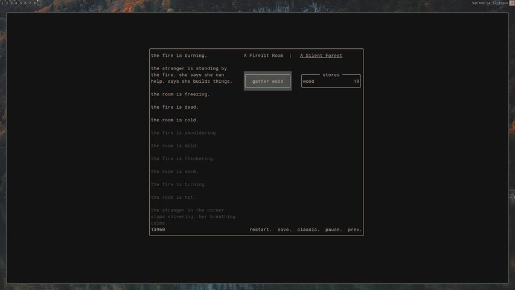

# A Dark Room (terminal port)

a minimalist text adventure game for your terminal

---

## Install

### Homebrew (macOS / Linuxbrew)

Once a tap exists at `jordangedney/homebrew-tap`:

```
brew tap jordangedney/tap
brew install adarkroom-port
adarkroom-port
```

The formula in `Formula/adarkroom-port.rb` builds from source via `cabal
v2-install` and depends on `ghc@9.10` and `cabal-install`. To try it
directly from this repo:

```
brew install --build-from-source ./Formula/adarkroom-port.rb
```

(Note: the `url` and `sha256` in the formula point at a `v0.1.0` release
tag. Until that tag is cut, use `brew install --HEAD ./Formula/adarkroom-port.rb`
to build from `master` instead.)

### From source

```
cabal v2-update
cabal v2-install --installdir=$HOME/.local/bin
```

On Debian/Ubuntu you may also need `libtinfo-dev`:

```
sudo apt-get install libtinfo-dev
```

---

## Releasing

To publish a new Homebrew release:

1. Bump `version` in `adarkroom-port.cabal` and add a `CHANGELOG.md` entry.
2. Tag the commit: `git tag v0.1.0 && git push origin v0.1.0`.
3. Compute the tarball sha256:
   ```
   curl -sL https://github.com/jordangedney/adarkroom-port/archive/refs/tags/v0.1.0.tar.gz \
     | shasum -a 256
   ```
4. Update `Formula/adarkroom-port.rb` (`url`, `sha256`) and copy the formula
   to `jordangedney/homebrew-tap` under `Formula/`.

---

A very much WIP terminal port of A Dark Room, which can be found here:

https://github.com/doublespeakgames/adarkroom

--


